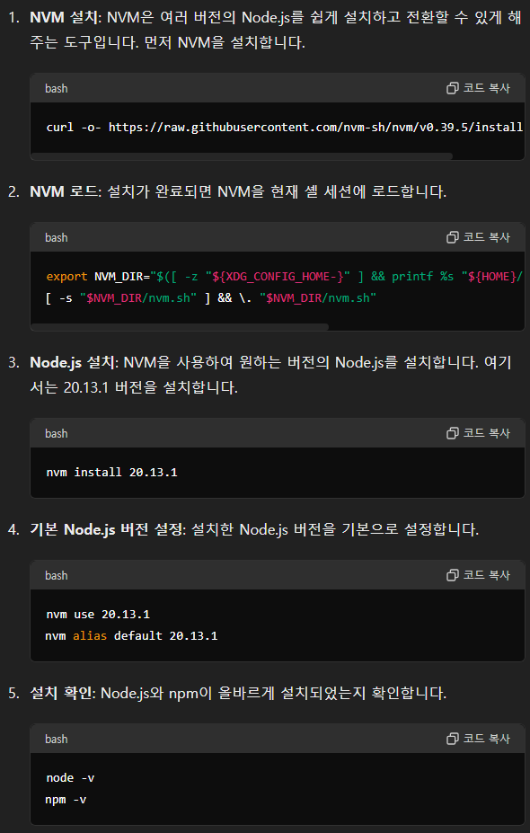
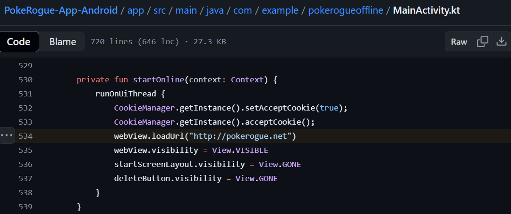

Pokerogue라는 게임을 해보기로 했다.  
Web 기반 게임이라는데, 나무위키 페이지를 보니 github에서 코드를 clone해서 할 수도 있다고 한다.
따라서, clone 해서 local 서버에서 구동시켜봤다.

web에서 굳이 하지 않는 이유
+ 정식 게임사가 아니라서 혹시 중간에 지원 안할까봐
+ "그냥"

## 1. WSL에서 PokeRogue 구동
### 설치과정

우선 [Github: PokeRogue](https://github.com/pagefaultgames/pokerogue) 를 참조해서 설치


```bash
git clone https://github.com/pagefaultgames/pokerogue
cd ./pokerogue/
npm install
npm run start:dev

```

당연하게도 나는 웹관련 작업을 해본적이 없어서 실행할 수 있는 기본 패키지가 없었다.  
따라서 우선은 npm을 설치해주고 진행

```bash
sudo apt-get install npm
npm install
npm run start:dev

```

여기서 어떤 오류가 떳었는데, 잘 기억은 안난다.  
대부분은 버전 문제이기 떄문에 버전을 확인해보니, 권장 버전이 아니었다.  
특히 wsl ubuntu 에서 기본으로 설치된 node 버전이 맞지 않았던 것 같다.

```bash
node -v # this should be 20.13.1 (Prerequisites)
npm -v
```

요즘 자주 사용하는 ChatGPT-4o에게 질문. (세상이 너무 좋다)




요약하자면, 
```bash
curl -o- https://raw.githubusercontent.com/nvm-sh/nvm/v0.39.5/install.sh | bash

export NVM_DIR="$([ -z "${XDG_CONFIG_HOME-}" ] && printf %s "${HOME}/.nvm" || printf %s "${XDG_CONFIG_HOME}/nvm")"
[ -s "$NVM_DIR/nvm.sh" ] && \. "$NVM_DIR/nvm.sh"

nvm install 20.13.1

nvm use 20.13.1
nvm alias default 20.13.1

node -v
npm -v

```

`export` 명령어는 `install.sh`에서 수행하라는 명령어와 동일했다.  
아무튼 이후 `npm run start:dev` 명령어를 통해 실행해주면 된다.

### 추가 설정

참고로, 나는 vscode를 통해 서버를 돌리므로 이를 끄면 서버가 꺼진다.  
따라서 `screen`으로 세션이 유지되도록 설정했다.

```bash
screen -S pokerogue
npm run start:dev

# [Ctrl + A, D] -> detach

screen -r pokerogue # attach
```

## 2. 모바일로도 하고싶다

### App build
여기 [GIthub: Pokerogue-App-Android](https://github.com/Admiral-Billy/PokeRogue-App-Android) 에 누가 잘 만들어놨음.



여기 부분만 내가 열어놓은 서버주소로 바꾸고 다시 app을 build하면 된다.  
(아래 "Port Open for WSL" 과정을 통해서 서버를 미리 밖으로 빼놔야함)

app build는 나는 Android Studio를 wsl에서 설치하고 했었음.  
그냥 build만 누르면 되는거라 어렵진 않음.

### Port Open for WSL
WSL에서 서버가 동작하기 때문에, WSL -> HOST -> ROUTER 로 연결해줘야한다.  
나는 WSL:8000 -> HOST:48000 -> ROUTER:48000 으로 연결해줌.  
아래와 같이 Powershell script를 작성해서 WSL 포트를 자동으로 연결해주고,  
공유기에서 포트포워딩으로 열어주면 된다.

```powershell
# C:\PowerShellScript\
# powershell -ExecutionPolicy Bypass -File .\wsl_port_forwarding.ps1

If (-NOT ([Security.Principal.WindowsPrincipal][Security.Principal.WindowsIdentity]::GetCurrent()).IsInRole([Security.Principal.WindowsBuiltInRole] "Administrator")) {   
  $arguments = "& '" + $myinvocation.mycommand.definition + "'"
  Start-Process powershell -Verb runAs -ArgumentList $arguments
  Break
}
 
$remoteport = bash.exe -c "ifconfig eth0 | grep 'inet '"
$found = $remoteport -match '\d{1,3}\.\d{1,3}\.\d{1,3}\.\d{1,3}';
 
if ($found) {
  $remoteport = $matches[0];
}
else {
  Write-Output "IP address could not be found";
  exit;
}

# Ports on Host
$ports = @(48000);

# Ports in WSL
$connectports= @(8000)
 
for ($i = 0; $i -lt $ports.length; $i++) {
  $port = $ports[$i];
  $connectport = $connectports[$i];

  Invoke-Expression "netsh interface portproxy delete v4tov4 listenport=$port";
  Invoke-Expression "netsh advfirewall firewall delete rule name=$port";
 
  Invoke-Expression "netsh interface portproxy add v4tov4 listenport=$port connectport=$connectport connectaddress=$remoteport";
  Invoke-Expression "netsh advfirewall firewall add rule name=$port dir=in action=allow protocol=TCP localport=$port";
}
 
Invoke-Expression "netsh interface portproxy show v4tov4";
 
 
#
```

### Session 관련

PokeRogue 코드를 잠깐 보니까 local에서 dev로 할 때에는 login 기능을 꺼둠.  
이걸 킨다고 해도 Database가 없기 때문에 login 기능을 사용할 수 없음.

친구들이랑 같이 하는게 아니라 나만 하고 싶다면,  
그냥 서버에 내 데이터만 저장하고 접근하면 그 데이터만 활용하도록 해도 되지 않을까..

쉽지 않을 것 같다...  
-> 그냥 우선 data를 직접 옮기는 방향으로.. 