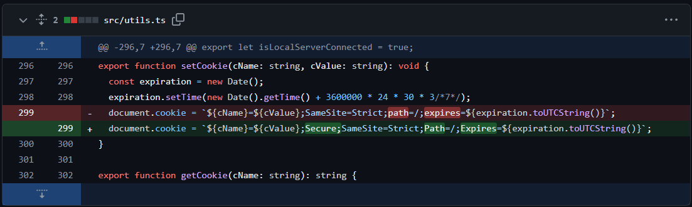

## 0. 서론
HTTPS 설정 관련 내용  
아직 하지는 않았는데, 업데이트에 관련 내용이 있어서 아래 잠시 적어둠  

## 1. 관련 내용

### https 관련 변경 내용

`ae02943` commit에서 https에서 아래와 같은 secure cookies 관련해서 패치를 함.



<br>
아래와 같이 다시 수정함

```diff
   // This can be done with using HTTPS
-  document.cookie = `${cName}=${cValue};Secure;SameSite=Strict;Path=/;Expires=${expiration.toUTCString()}`;
   // Using HTTP, use original code
+  document.cookie = `${cName}=${cValue};SameSite=Strict;path=/;expires=${expiration.toUTCString()}`;
```

이 부분을 이전대로 일반 cookies를 사용해야 missing token 문제가 해결된다.$$