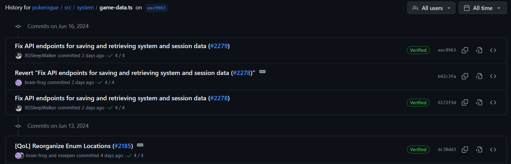

## 0. 서론
충돌이 나서 서버를 초기화해야했다.  
데이터는 매번 저장해놨어서 문제는 없는데,  
update를 더이상 못할까봐 걱정..  

## 1. 관련 내용

### 0x01
우선 개발자모드에서 로그를 보면 API가 제대로 실행되지 않아서 Back-end가 업데이트 됐나 싶었다.  
근데 아무리 봐도 최근에 업데이트가 없어서 front-end쪽을 봤더니 아래와 같은 commit이 있었다.  



API endpoint를 바꿧다고 해서 봤는데, 확실히 url이 달라졌고 내 서버에서는 동작하지 않았다.  
업데이트를 해봐도 안됐는데, 세션아이디 문제였나 기억은 안남.  

아무튼 나중에 해결하기로 하고 무식하게 저 commit 직전까지만 update하기로함.  

```bash
git fetch upstream
git merge upstream/master
git reset --hard dc30dd33b226a22d3ce32df4d8f442f53f2ed04e
// modify custom
git push origin master --force
```

위와 같이 강제로 revert한 후에 다시 front-end를 custom 설정해주었다.  
DB도 초기화했어서 수동으로 trainerId와 secretId 맞춰줘서 데이터를 로드함 

### 0x01_update
어떤 문제인지 확인.  
rogueserver의 업데이트를 반영하려면 새로 build를 해야했다..  
나는 귀찮아서 1.22 버전의 go를 PATH 자동설정 안해줘서 아래와 같이 함

```bash
cd rogueserver
/usr/local/go/bin/go build .
```