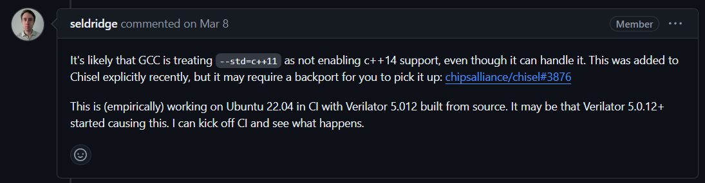
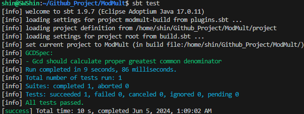
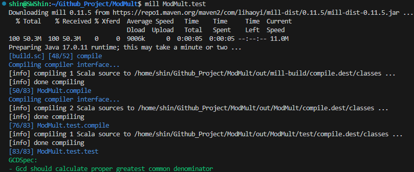

## 서론
Modular Multiplier를 하드웨어로 구현하는 연구를 진행중인데, Chisel을 사용하기로 했다.  
나는 원래 Python과 Verilog를 통해서 연구를 수행해 왔는데, 최근 몇가지 불편함을 느꼇다.  

우선, 나는 알고리즘을 검증하기 위해 Python을 활용해서 알고리즘을 구현한다.  
(원래 C로 작성하려고 했으나, 128-bit 이상의 데이터를 다루는 것이 번거로워서 python을 사용함)  
테스트를 통과한 알고리즘은 verilog로 구현한다.

하드웨어 구현 과정에서 bit연산을 활용한 최적화를 자주 하는데,  
이는 python에서는 굳이 하지 않기 때문에 알고리즘을 두번에 걸쳐 최적화 하는 느낌이다.  
또한, 개인적으로 testbench를 SystemVerilog로 구현하기가 어려운 것 같다.

**Chisel**을 사용하게 되면,  
처음부터 하드웨어 스타일로 코딩하기 때문에 구현을 두번에 나눠서 할 필요가 없다.  
verilog로 변환도 할 수 있다.  
중간중간 데이터도 print할 수 있기 때문에 디버깅도 편할 것 같다.

따라서 Chisel을 사용해보려고 한다.


## 설치
물론 WSL에서 설치.

[Chisel-lang](https://www.chisel-lang.org/docs/installation)의 Installation을 따라한다.  
아래 내용은 링크를 따라한 내용을 간략하게 정리함.  

### 1. Quickstart with Scala CLI
```bash
# https://scala-cli.virtuslab.org/install/
curl -sS "https://virtuslab.github.io/scala-cli-packages/KEY.gpg" | sudo gpg --dearmor  -o /etc/apt/trusted.gpg.d/scala-cli.gpg 2>/dev/null
sudo curl -s --compressed -o /etc/apt/sources.list.d/scala_cli_packages.list "https://virtuslab.github.io/scala-cli-packages/debian/scala_cli_packages.list"
sudo apt update
sudo apt-get install scala-cli

curl -O -L https://github.com/chipsalliance/chisel/releases/latest/download/chisel-example.scala

scala-cli chisel-example.scala
```
참고로, 첫 명령어는 KEY를 저장하는 게 아니라서 "|"를 빼고 한개씩 실행하면 안된다.  

### 2. Dependencies
### Java Development Kit (JDK)
Scala 언어는 JVM에서 동작하기 떄문에 설치해줘야한다.  
옛날에 java버전관련해서 고생한 기억이 있다.  
버전관련 내용을 잘 찾아보고 왠만하면 권장하는 버전을 사용하자.

> Chisel works on any version of Java version or newer,  
> however, we recommend using an LTS version 17 or newer.  
> 
> Note that Scala CLI requires Java 17 or newer so unless your system installation of Java is at least version 17,
> Scala CLI will download Java 17 for its own use.
>
> You can install any distribution of the JDK you prefer.  
> Eclipse Adoptium Temurin is a good option with support for all platforms: https://adoptium.net/installation

```bash
sudo apt install -y wget gpg apt-transport-https
wget -qO - https://packages.adoptium.net/artifactory/api/gpg/key/public | gpg --dearmor | sudo tee /etc/apt/trusted.gpg.d/adoptium.gpg > /dev/null
echo "deb https://packages.adoptium.net/artifactory/deb $(awk -F= '/^VERSION_CODENAME/{print$2}' /etc/os-release) main" | sudo tee /etc/apt/sources.list.d/adoptium.list
sudo apt update
sudo apt-get install temurin-17-jdk
```
<br>
혹시 이미 다른 버전이 설치되어 있다면 아래 명령어들을 활용해서 쉽게 선택할 수 있다.
```bash
# 버전 확인
java -version

# java 버전 선택
sudo update-alternatives --config java
```
<br>
최종적으로 내가 설치한 버전은 아래와 같다.
```bash
$ java -version
openjdk version "17.0.11" 2024-04-16
OpenJDK Runtime Environment Temurin-17.0.11+9 (build 17.0.11+9)
OpenJDK 64-Bit Server VM Temurin-17.0.11+9 (build 17.0.11+9, mixed mode, sharing)
```


### Build Tools
#### Mill
최근 등장한 Scala build tool로, Chisel에서는 SBT보다 Mill을 권장한다고 한다.
```bash
curl -L https://raw.githubusercontent.com/lefou/millw/0.4.11/millw > mill && chmod +x mill
sudo mv mill /usr/local/bin/
```

#### SBT
원조 **S**cala **B**uild **T**ool 이라고 함
```bash
curl -s -L https://github.com/sbt/sbt/releases/download/v1.9.7/sbt-1.9.7.tgz | tar xvz
sudo mv sbt/bin/sbt /usr/local/bin/
```

### Firtool

Chisel로 구현한 하드웨어 로직을 verilog 수준까지 IR 컴파일 툴인 것 같다. ([CIRCT](https://circt.llvm.org/), [Github](https://github.com/llvm/circt) 참고)  

사용하는 Chisel 버전에 적합한 firtool은 [Versoning](https://www.chisel-lang.org/docs/appendix/versioning#firtool-version)을 참고하라고 한다.  
가이드에서는 query를 통해서 간단하게 버전을 찾고 설치하는 아래 명령어를 추천해줬다.  
```bash
scala-cli -S 2.13 -e 'println(chisel3.BuildInfo.firtoolVersion)' --dep org.chipsalliance::chisel:6.0.0
```

### Verilog Simulation
#### Verilator
오픈소스 Verilog Simulator. 필수 tool이다. 

옛날 리눅스에서 아래 명령어를 통해서 설치하면 Verilator도 너무 옛날 버전이 설치될 수 있다고 한다.
```bash
sudo apt-get install -y verilator
```
이후에 프로젝트를 생성하고 테스트 코드를 구동하는데, verilator 관련해서 문제가 있었다.  
혹시 설치된 verilator의 버전이 5.0.12보다 낮다면 동일한 문제가 발생할 가능성이 있으니 **ISSUE** 참고..

<details markdown="1">
<summary><b>ISSUE</b></summary>

<br>
[Github Issue](https://github.com/chipsalliance/chisel-template/issues/127)와 동일한 문제가 발생했고, 해당 이슈의 답글을 보고 해결했다.

<br>
내 환경은 아래와 같았다.
```bash
$ verilator --version
Verilator 4.038 2020-07-11 rev v4.036-114-g0cd4a57ad

$ cat /etc/issue
Ubuntu 22.04.4 LTS \n \l
```
<br>
Issue에서 말했던 것처럼 경험적으로 5.0.12+에서는 된다고 하니까, 삭제하고 다시 설치했다.  
[Verilator: Git Quick Install](https://veripool.org/guide/latest/install.html#git-quick-install)을 참고했다.
```bash
sudo apt remove verilator

# Prerequisites:
sudo apt-get install git help2man perl python3 make autoconf g++ flex bison ccache
sudo apt-get install libgoogle-perftools-dev numactl perl-doc
sudo apt-get install libfl2  # Ubuntu only (ignore if gives error)
sudo apt-get install libfl-dev  # Ubuntu only (ignore if gives error)
sudo apt-get install zlibc zlib1g zlib1g-dev  # Ubuntu only (ignore if gives error)

git clone https://github.com/verilator/verilator
cd verilator
git checkout v5.012

autoconf
./configure
make -j `nproc`
sudo make install

verilator --version
```
</details>

## 프로젝트 생성
[Github : chisel-template](https://github.com/chipsalliance/chisel-template)  
Github에 이런 기능이 있는줄 몰랐는데, 쉽게 프로젝트를 생성할 수 있다.  
`Use this template`로 프로젝트롤 가져오면, 알아서 template-specific stuff를 없애고 첫 commit을 해준다.

생성한 repository를 clone한 후, 최상위 폴더에서 아래처럼 테스트하면 된다.
```bash
sbt test
```


```bash
mill %NAME%.test
```


두 binary를 모두 정상적으로 빌드하고 테스트하는 것을 확인했다.  
mill을 권장했으니, 앞으로는 mill로 test를 해볼 것 같다.